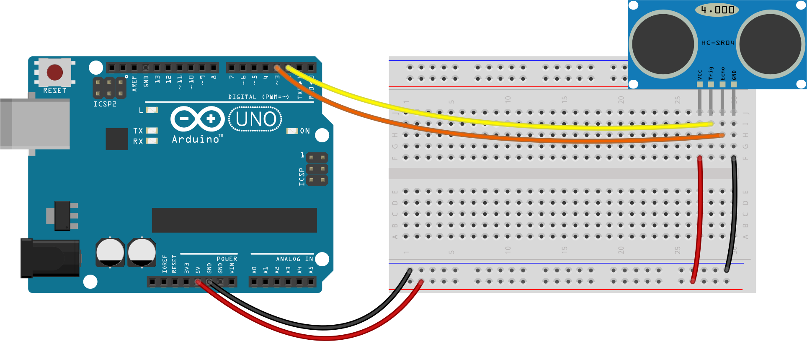

# Informasjon til veiledere

## Læringsmål

Oppgaven «Ultralyd sensor» introduserer flere konsepter:

+ Bruk av ultralyd sensor
+ Seriellkonsoll

# Koblingsskjema



# Hjelp til 7-segment-utfordringen

```cpp
const auto ekko = 2; // Echo pin
const auto sender = 3; // Trig pin
const auto lydens_hastighet = 0.034029; // 340.29 m/s

void setup() {
  Serial.begin(9600);
  pinMode(ekko, INPUT);
  pinMode(sender, OUTPUT);

  digitalWrite(sender, LOW);
}

void loop() {
  digitalWrite(sender, HIGH);
  delayMicroseconds(5);
  digitalWrite(sender, LOW);

  auto tid = pulseIn(ekko);
  auto avstand = (tid * hastighet) / 2;

  auto syvsegment = map(avstand, 0, 127, 0, 9);
  Serial.print("Om du hadde hatt et display burde det vist tallet ");
  Serial.println(constrain(syvsegment, 0, 9));

  delay(100);
}
```

`map` vil lineært skalere avstanden mellom verdiene. Så en avstand på over 127 cm vil få høyere verdier enn 9.

For formelen map bruker, se referansen for map hos [arduino.cc](https://www.arduino.cc/Reference/Map).

`constrain` vil her gjøre at alle verdier høyere enn 9 vil bli satt til 9.
