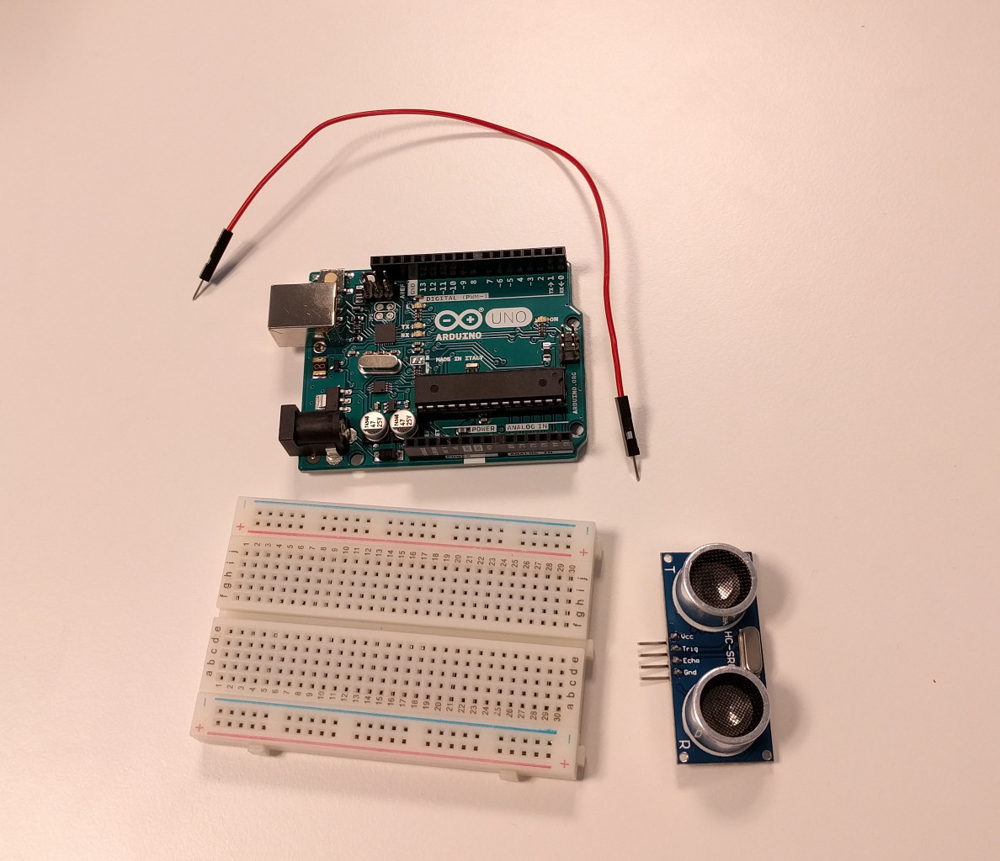
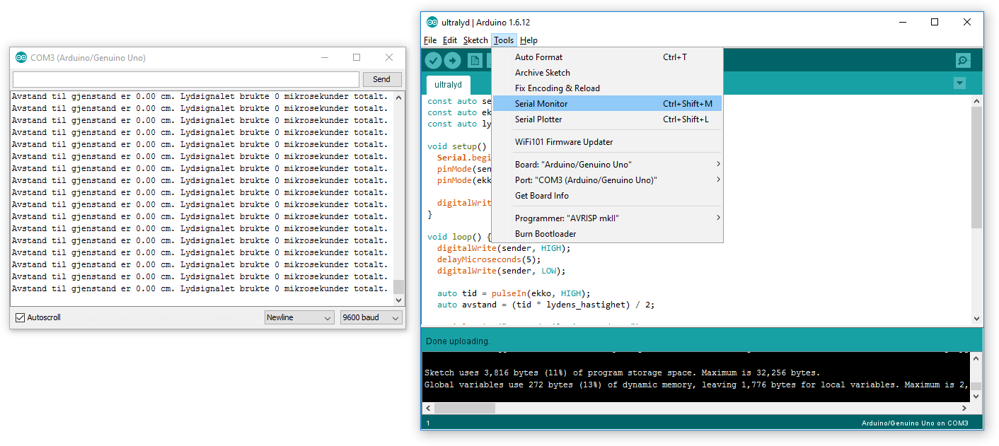

# Introduksjon {.intro}

I denne oppgaven skal vi se på bruken av en ultralyd-sensor.

# Steg 1: Finn frem utstyr {.activity}

## Til denne oppgaven trenger du {.check}

+ 1 Arduino Uno
+ 1 breadboard
+ 1 ultralyd-sensor
+ 6 ledninger



# Steg 2: Koble opp kretsen {.activity}

Hvis du ser på pinnene på ultralyd-sensoren vil du se at over de står det `Gnd`, `Echo`, `Trig` og `Vcc`.

`Gnd` er jord, `Vcc` er 5V strøm, `Echo` og `Trig` er digitale pinner.

Koble opp kretsen, snakk med veileder hvis du står fast og trenger hjelp, men gjør et forsøk selv først.

## Skriv kode {.activity}

```cpp
const auto ekko = 2; // Echo pin
const auto sender = 3; // Trig pin
const auto lydens_hastighet = 0.034029; // 340.29 m/s

void setup() {
  Serial.begin(9600);
  pinMode(ekko, INPUT);
  pinMode(sender, OUTPUT);

  digitalWrite(sender, LOW);
}

void loop() {
  digitalWrite(sender, HIGH);
  delayMicroseconds(10);
  digitalWrite(sender, LOW);

  auto tid = pulseIn(ekko);
  auto avstand = (tid * hastighet) / 2;

  Serial.print("Avstand til gjenstand er ");
  Serial.print(avstand);
  Serial.print(" cm. Lydsignalet brukte ");
  Serial.print(tid);
  Serial.println(" mikrosekunder totalt");

  delay(100);
}
```

## Seriellkonsoll {.protip}

For å kunne lese hva vi skriver ut må du se på det som kalles et seriellkonsoll. `Serial.print` og `Serial.println` får
arduinoen til å skrive til sin seriellkonsoll, som kan leses fra en pc koblet til arduinoen med USB ledning.

For å åpne seriellkonsollet går du til __Tools -> Serial Monitor__



## Utfordring {.challenge}

+ Klarer du å få en lysdiode til å lyse når noe er nærmere enn 20 cm?
+ klarer du å få en lysdiode til å lyse sterkere jo nærmere noe er (husk PWM pins)?

## Utfordring (Vanskelig) {.challenge}

+ Klarer du å få et 7-Segment Display til å si hvor nærme du er på en skala fra 0-9 (husk `map`-funksjonen)?
